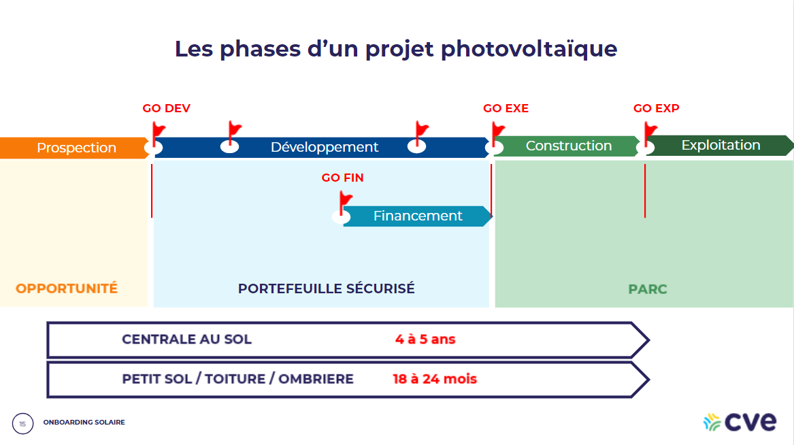

• Outil de prospection
• BIBLOS --> supports de formation
• Paramétrage des signatures électroniques
Application téléphone : https://apps.apple.com/fr/app/dynamics-365-for-phones/id1003997947 (Dynamic 365 Sales)

| Entité | Description |
|:----------:|:---------|
| Lead | - Création du lead suite à l’identification d’un foncier par le CP   - Date GO/NOGO => Est-ce qu'on transforme du lead en opportunité ou pas ? |
| Tiers | Privé (entreprise) ou public (collectivité) |

Qualification d'un lead dont on n'est pas le propriétaire
1. Remplacer le propriétaire actuel par soi
2. Renseigner dans le champ "Originateur du lead", le propriétaire actuel. Cela permet de garder une trace dans BOOST de la personne qui est à l'origine du lead.

