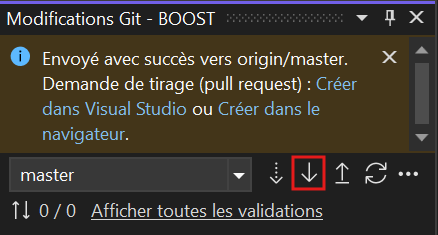

- La logique doit être faite dans le service (ex CodeNasService) et non dans dans la classe (ex CodeNas)
- Pour créer une entité : UserSercie.Create(entity)
- Compiler le CS => Déployer sur XrmToolBox

### Coding process
1. Pull the code stored on Git   
2. Add your code and save.
3. Build the solution : generates the DLL in the solution folder.
4. Open "Plugin Registration" in XrmToolBox to update the plugin with the generated DLL.
5. Test
6. Enter the commit message, then push the changes to Git.

### ⌘ Keyboard shortcuts (Microsoft Visual Studio)
 (A CONFIRMER)    

