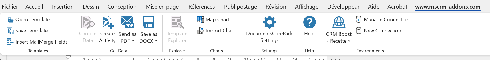

https://www.mscrm-addons.com/
 
- Outil permettant de générer des documents basées sur des tables avec des conditions d'affichage (seulement pour les word)
- Le site concerne le paramétrage côté serveur et l'application le paramétrage côté client (DataProvider à ouvrir en tant qu'administrateur)
- Modifier la licence dans le paramétrage de l'environnement afin de pouvoir paramétrer un template
- Passer par la recherche avancée si besoin de modifier le fetch
- Faire les modifications en recette puis exporter en production
 

  
