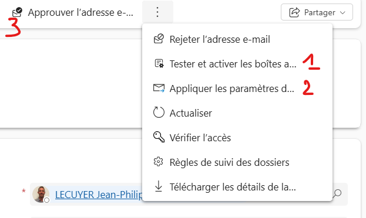

### 📚 Index
1. [Plan Desginer](#-plan-designer-)
2. [Useful links](#-useful-links-)
  

#### <ins> Plan Designer </ins>
📖 Description  
Plan designer helps to create a plan for your existing solution or a new one using copilot. It generates a detailed document that describes your solution. The plan covers the business problem, user requirements like user roles and stories, the data model, and technologies like apps. This feature saves time when you're trying to understand a solution's content and helps makers improve an existing solution.

🔗 Documentation
- [Overview of Plan Designer](https://learn.microsoft.com/en-us/power-apps/maker/plan-designer/plan-designer)
  

#### <ins> Dynamics 365 App for Outlook </ins>
📖 Description  
Link mails/appointment to records

⚙️How to install the plugin on a email user  
In Power App, go to Advanced setting > Email configuration > Mailboxes  

  

#### <ins> Useful links </ins>
- [Restricted tables requiring Dynamics 365 licenses](https://learn.microsoft.com/en-us/power-apps/maker/data-platform/data-platform-restricted-entities)
- [Virtual tables and lookup columns](https://mattruma.com/adventures-with-dataverse-virtual-tables-and-look-up-columns/?utm_source=substack&utm_medium=email)  

Plug-in outlook : Pour connecter une table à outlook : rajouter la table dans l'application "Dynamics 365 App for Outlook

